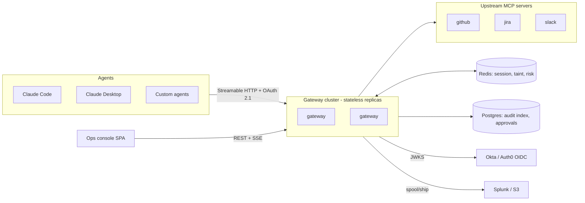

# Architecture — MCP Security Gateway

Greenfield architecture for the productized gateway. The existing code in
`gateway/` and `dashboard/` is the **reference prototype**: it proved the
enforcement semantics, and its demo scripts become the acceptance tests for
this build. Design rationale for each technology lives in
[SYSTEM_DESIGN.md](SYSTEM_DESIGN.md); this document is *what the pieces are
and how they fit*.

---

## 1. Deployment topologies

One binary, two modes (same pipeline, same policy packs):

### Sidecar (wrap) mode — the 5-minute path

```
Claude Desktop / Code                    mcp-gateway wrap                    real MCP server
┌──────────────────┐   stdio JSON-RPC   ┌───────────────────┐   stdio      ┌──────────────────┐
│  agent (client)  │ ─────────────────> │ enforcement       │ ───────────> │ e.g. github-mcp, │
│                  │ <───────────────── │ pipeline          │ <─────────── │ filesystem…      │
└──────────────────┘                    └───────────────────┘  subprocess  └──────────────────┘
                                          │            │
                                    policy packs   audit spool ──> console / sinks
```

State: in-memory. Storage: JSONL spool + SQLite. Identity: pinned at launch.

### Central service mode — the enterprise path



Routing: each upstream is a distinct endpoint (`/servers/github/mcp`), bound
to its connector pack. Per-endpoint isolation keeps policy attribution and
`tools/list` filtering trivial; a namespaced aggregation endpoint can come
later.

---

## 2. The core abstraction: the enforcement pipeline

Every MCP message flows through an **interceptor chain** (Envoy-filter
style). Each stage is a small class with one job; stages are assembled per
deployment; connectors and plugins can register stages. All stages emit audit
events through one recorder.

### Request path (`tools/call`)

| # | Stage | Job | On failure/trigger |
|---|---|---|---|
| 1 | **Decode** | Parse JSON-RPC envelope; correlate ids | Malformed → pass through opaque (not ours to judge), audit |
| 2 | **Route** | Non-`tools/call` methods: pass through; `tools/list`: **filter to policy-visible tools** | — |
| 3 | **Identify** | Resolve `Principal` (OIDC/API key/static) + roles | Fail closed |
| 4 | **Session gate** | Load session; suspended sessions get nothing | Deny |
| 5 | **Policy match** | Tool rule lookup (exact > glob > default) + role overlay → effective rule | Default action if no rule |
| 6 | **Constraints** | Argument-level checks (regex, plugin: JQL, branch, repo-allowlist) | Block + risk points |
| 7 | **Sequence/taint gate** | Session-history rules; taint sinks blocked in tainted sessions | Block + risk points |
| 8 | **Approval** | `require_approval` → ask a human via channel; deadline; fail-closed | Deny + risk points |
| 9 | **Transform** | Apply rewrites; redact *arguments* (outbound DLP) | — |
| 10 | **Record & mark** | Append to session history; mark taint if source; register pending response handling | — |
| 11 | **Forward** | Send upstream with timeout budget | JSON-RPC error to client |

### Response path

| # | Stage | Job |
|---|---|---|
| 12 | **Correlate** | Match response id → pending disposition (redact / quarantine / plain) |
| 13 | **Result control** | Quarantine: withhold result, substitute notice. Redact: run redaction profile; over-budget or detector error → quarantine (never release unscanned data) |
| 14 | **Risk** | Score events (heavy redaction, violations); auto-suspend at threshold, broadcast via state store |
| 15 | **Anomaly** | Debounced behavioral assessment (heuristic/Claude); verdict feeds risk |
| 16 | **Deliver** | Send to client |

**Ordering rationale worth remembering:**

- Cheap static checks (5–6) before session checks (7) before **human
  attention (8)** — an approver must never be asked about a call that taint
  rules would block anyway. (The prototype had 8 before 7; this is a
  deliberate greenfield fix.)
- Taint marking (10) happens *after* the gates so a blocked source call
  doesn't taint the session.
- `tools/list` filtering (2) is new: tools the policy would block are
  invisible to the model — smaller prompt-injection surface, no wasted agent
  turns on doomed calls.

### The context object

One `CallContext` travels the chain: principal, session handle, raw + effective
message, decision, redaction reports, per-stage timings. Every audit event and
metric derives from it — single source of truth per call.

---

## 3. Plugin system

Discovery via Python entry points (`mcp_gateway.plugins` group) plus a local
`plugins/` directory for customer-private code. All extension points are
small interfaces:

```python
class Transport(Protocol):
    async def serve(self, handler: MessageHandler) -> None: ...

class IdentityProvider(Protocol):
    async def authenticate(self, ctx: RequestContext) -> Principal: ...

class ActionHandler(Protocol):          # allow/block/redact/rewrite/quarantine/approval/…
    name: str
    async def on_request(self, call: CallContext) -> Disposition: ...
    async def on_response(self, call: CallContext) -> None: ...

class Constraint(Protocol):             # regex builtin; jql/branch/… from connectors
    def check(self, args: dict, ctx: CallContext) -> Violation | None: ...

class Detector(Protocol):               # redaction
    def detect(self, text: str, ctx: DetectionContext) -> list[Span]: ...

class Operator(Protocol):               # mask/hash/tokenize/drop
    def apply(self, text: str, span: Span) -> str: ...

class ApprovalChannel(Protocol):
    async def request(self, req: ApprovalRequest) -> Resolution: ...   # deadline enforced by broker

class AuditSink(Protocol):
    async def emit(self, batch: list[Event]) -> None: ...              # reads from spool, at-least-once

class AnomalyBackend(Protocol):
    async def assess(self, trace: SessionTrace) -> Verdict | None: ...

class StateStore(Protocol):             # memory / redis: sessions, taint, risk, suspensions
    ...
```

New capabilities — a `rate_limit` action, a JQL constraint, a Splunk sink, an
OPA constraint bridge — are files implementing one interface, not engine
changes.

---

## 4. Connector packs

A connector is **not an API client** (the upstream MCP server talks to
GitHub). It is a curated security bundle for one MCP server:

```
connectors/github/
├── manifest.yaml     # which server + versions tested, launch template, endpoint binding
├── tools.yaml        # full tool inventory, risk-classified: read/write/destructive/secret-adjacent
├── policy.yaml       # shipped default policy (uses every relevant gateway feature)
├── roles.yaml        # role matrix: developer / reviewer / release-manager / bot
├── constraints.py    # e.g. protected-branch, org-boundary checks
├── detectors.py      # e.g. GitHub PAT patterns, Actions-log secret shapes
├── policy_tests.yaml # golden decisions: given call → expected outcome
└── README.md         # threat model, every rule explained, how to override
```

`mcp-gateway add github` installs the pack; a company's `overrides.yaml`
customizes it without forking. Packs version independently and pin the
upstream server versions they were validated against.

---

## 5. Policy model

- **Layered merge, defined precedence:** company override > connector pack >
  gateway base defaults. Effective policy is compiled at load, inspectable
  via `mcp-gateway policy show --effective`.
- **Match order:** exact tool name > glob (`github.repos.*`) > default action.
- **Role overlays** replace only the fields they name (action, constraints,
  rewrites, redaction profile, `then`).
- **Redaction profiles by reference:** a rule says `redaction: strict`, the
  profile defines detectors/operators/entities — policy stays readable.
- Every document carries `schema_version`; schemas are published JSON Schema
  (editor autocomplete via `$schema`).
- Runtime holds a compiled, immutable snapshot; reload swaps atomically on a
  validated (and, in production, signed) bundle only.

Session-state controls (taint sources/sinks, sequence rules) and risk
weights/thresholds live beside the tool rules in the same pack.

---

## 6. Data model (wire-level)

Audit event (JSONL spool line; `schema_version` from day one):

```json
{
  "schema_version": 1,
  "ts": "2026-07-19T18:04:11.302Z",
  "event": "tool_call_blocked",
  "session_id": "b8c31f02",
  "principal": {"sub": "harsh@acme.com", "roles": ["developer"]},
  "server": "github",
  "tool": "push_files",
  "request_id": 42,
  "decision": {"action": "block", "rule": "github.protected-branches", "reason": "push to main forbidden"},
  "risk": {"delta": 20, "score": 45, "level": "normal"},
  "taint": {"tainted": true, "origin": "get_issue"},
  "redactions": null,
  "stage_timings_ms": {"policy": 0.2, "constraints": 0.4}
}
```

Conventions: decisions and *counts* always; raw arguments only where the
policy explicitly opts in (the backtester treats their absence as
partial-confidence, as the prototype already does). Sessions, approvals, and
the SQLite/Postgres index schemas all derive from this event stream and are
rebuildable from the spool.

---

## 7. Project layout (target repo)

```
mcp-gateway/
├── pyproject.toml              # extras: [server] [presidio] [oidc] [s3] [splunk] [postgres] [redis] [dev]
├── src/mcp_gateway/
│   ├── cli/                    # wrap | serve | init | add | policy (validate/test/backtest/show) | audit
│   ├── core/
│   │   ├── pipeline.py         # chain assembly, stage ordering
│   │   ├── context.py          # CallContext, Principal, Decision
│   │   ├── session.py          # session registry over StateStore
│   │   └── errors.py
│   ├── protocol/               # JSON-RPC codec, id correlation, tools/list filtering, MCP session mgmt
│   ├── transports/             # stdio.py, streamable_http.py
│   ├── policy/
│   │   ├── loader.py merge.py matcher.py schema.py compile.py
│   │   ├── actions/            # one file per action
│   │   └── constraints/        # base + regex builtin + plugin registry
│   ├── redaction/
│   │   ├── engine.py entities.py profiles.py context.py structured.py report.py
│   │   ├── detectors/          # regex_pii.py secrets.py presidio.py custom.py
│   │   └── operators/          # mask.py hash.py tokenize.py drop.py
│   ├── identity/               # static.py apikey.py oidc.py mapping.py
│   ├── approvals/              # broker.py channels/{console,slack,webhook}.py
│   ├── anomaly/                # heuristic.py claude.py
│   ├── risk/                   # scoring.py thresholds
│   ├── audit/
│   │   ├── events.py recorder.py spool.py ocsf.py
│   │   └── sinks/              # sqlite.py s3.py splunk.py webhook.py kafka.py(later)
│   ├── state/                  # memory.py redis.py; sqlite.py postgres.py (index stores)
│   ├── connectors/             # base.py registry.py github/ jira/ slack/ filesystem/
│   └── console/                # FastAPI app: REST+OpenAPI, SSE feed, approvals, static SPA
├── policies/                   # base.yaml + JSON Schemas
├── deploy/                     # Dockerfile, docker-compose.yaml, helm/
├── docs/                       # these documents + per-connector threat models
└── tests/
    ├── unit/  golden/          # policy decision goldens
    ├── redaction_corpus/       # labeled PII/secrets corpus + precision/recall eval
    └── e2e/                    # prototype demo scenarios re-cast as acceptance tests
```

---

## 8. Trust boundaries

| Zone | Trust | Consequence |
|---|---|---|
| Agent/LLM | Semi-trusted — may be hijacked by prompt injection | That's the threat model: policy + taint + sequence assume the agent can turn hostile mid-session |
| Tool results & third-party content (issue bodies, messages, web pages) | **Untrusted** | Taint sources; redaction before model exposure; never parsed as instructions |
| Upstream MCP servers | Semi-trusted (customer-operated, may be buggy/compromised) | Results inspected; gateway never forwards credentials it doesn't need to |
| Policy repo | Trusted **after** signature + validation | Signed bundles; last-known-good on failure |
| Console users | Authenticated & role-scoped | Approver actions are audited principal-level |
| Gateway itself | Crown jewel | Minimal deps, SBOM, no default payload persistence, secrets via env/KMS |

Failure-mode behaviors for every component are specified in
[SYSTEM_DESIGN.md §12](SYSTEM_DESIGN.md#12-reliability--failure-matrix).
